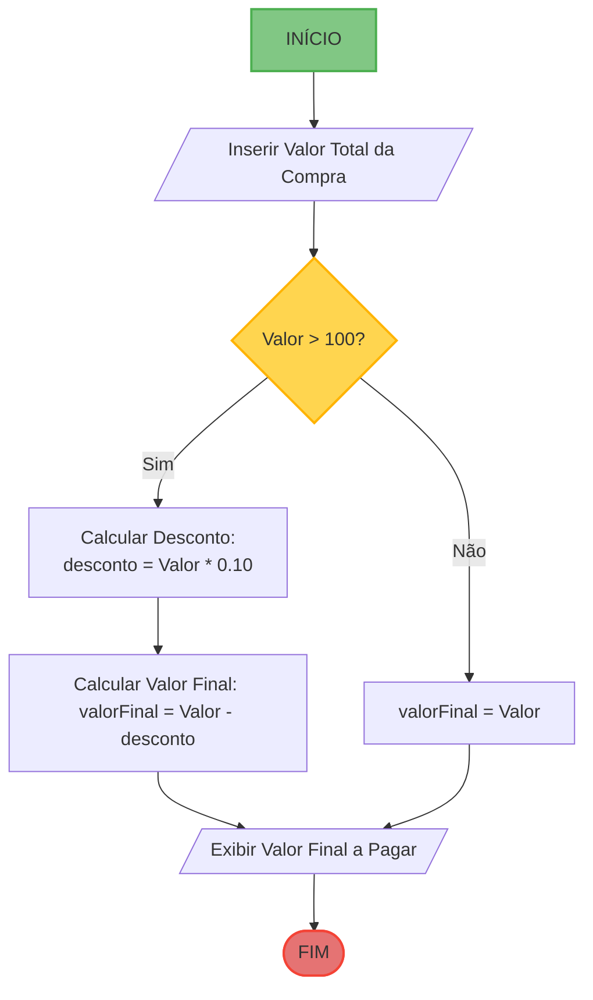

```mermaid
graph TD
    %% Estilizaçao e Direção (Top-Down)
    A[INÍCIO] --> B[/Inserir Valor Total da Compra/]

    %% Decisão do Desconto
    B --> C{Valor > 100?}

    %% Caminho com Desconto
    C -- Sim --> D[Calcular Desconto: <br>desconto = Valor * 0.10]
    D --> E[Calcular Valor Final: <br>valorFinal = Valor - desconto]

    %% Caminho sem Desconto
    C -- Não --> F[valorFinal = Valor]

    %% União dos caminhos e Fim
    E --> G[/Exibir Valor Final a Pagar/]
    F --> G
    G --> H([FIM])

    %% Estilos visuais para destacar os blocos
    style C fill:#ffd54f,stroke:#ffb300,stroke-width:2px
    style A fill:#81c784,stroke:#4caf50,stroke-width:2px
    style H fill:#e57373,stroke:#f44336,stroke-width:2px
```
